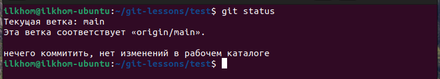
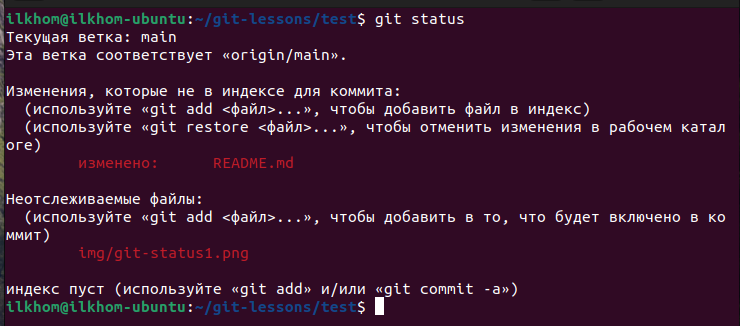
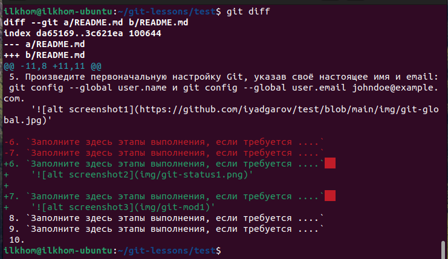
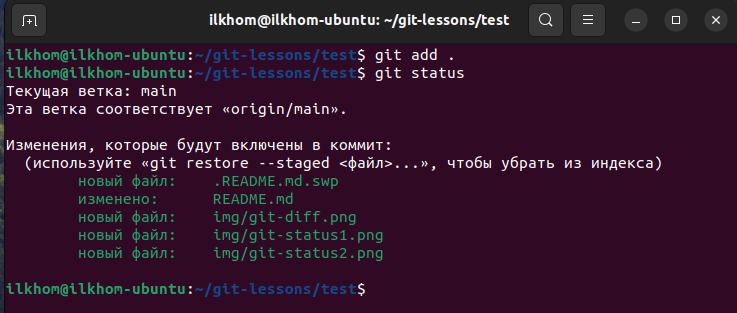
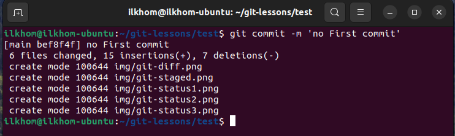

# Домашнее задание к занятию "`GIT`" - `Ильхом Ядгаров`

### Задание 1

`Приведите ответ в свободной форме........`

1. Зарегистрируйте аккаунт на GitHub - **выполнено!** iyadgarov
2. Создайте публичный репозиторий. Обязательно поставьте галочку в поле «Initialize this repository with a README». - **выполнено!** test
3. Склонируйте репозиторий, используя https протокол. - **выполнено!** git clone https://https://github.com/iyadgarov/test
4. Перейдите в каталог с клоном репозитория. - **выполнено!**
5. Произведите первоначальную настройку Git, указав своё настоящее имя и email: git config --global user.name и git config --global user.email johndoe@example.com.
   **выполнено!**  
    ''

6. Выполните команду git status и запомните результат.
   **выполнено!**  
    ''

7. Отредактируйте файл README.md любым удобным способом, переведя файл в состояние Modified..`  
    **выполнено!** 
8. Ещё раз выполните git status и продолжайте проверять вывод этой команды после каждого следующего шага.
    **выполнено!**    
    ''
9. Посмотрите изменения в файле README.md, выполнив команды git diff и git diff --staged.
    **выполнено!**
    ''
10. Переведите файл в состояние staged или, как говорят, добавьте файл в коммит, командой git add README.md.  
    **выполнено!**  
    ''  
11. Ещё раз выполните команды git diff и git diff --staged.  
    **выполнено!**
12. Теперь можно сделать коммит git commit -m 'First commit'.  
    **выполнено!**
    ''
13. Сделайте git push origin master
    **выполнено!**
    


Поле для вставки кода...
....
....
....
....


`При необходимости прикрепитe сюда скриншоты
`


---

### Задание 2

`Приведите ответ в свободной форме........`

1. `Заполните здесь этапы выполнения, если требуется ....`
2. `Заполните здесь этапы выполнения, если требуется ....`
3. `Заполните здесь этапы выполнения, если требуется ....`
4. `Заполните здесь этапы выполнения, если требуется ....`
5. `Заполните здесь этапы выполнения, если требуется ....`
6. 

```
Поле для вставки кода...
....
....
....
....
```

`При необходимости прикрепитe сюда скриншоты
`


---

### Задание 3

`Приведите ответ в свободной форме........`

1. `Заполните здесь этапы выполнения, если требуется ....`
2. `Заполните здесь этапы выполнения, если требуется ....`
3. `Заполните здесь этапы выполнения, если требуется ....`
4. `Заполните здесь этапы выполнения, если требуется ....`
5. `Заполните здесь этапы выполнения, если требуется ....`
6. 

```
Поле для вставки кода...
....
....
....
....
```

`При необходимости прикрепитe сюда скриншоты
`

### Задание 4

`Приведите ответ в свободной форме........`

1. `Заполните здесь этапы выполнения, если требуется ....`
2. `Заполните здесь этапы выполнения, если требуется ....`
3. `Заполните здесь этапы выполнения, если требуется ....`
4. `Заполните здесь этапы выполнения, если требуется ....`
5. `Заполните здесь этапы выполнения, если требуется ....`
6. 

```
Поле для вставки кода...
....
....
....
....
```

`При необходимости прикрепитe сюда скриншоты
`

---
## Дополнительные задания (со звездочкой*)

Эти задания дополнительные (не обязательные к выполнению) и никак не повлияют на получение вами зачета по этому домашнему заданию. Вы можете их выполнить, если хотите глубже и/или шире разобраться в материале.

### Задание 5

`Приведите ответ в свободной форме........`

1. `Заполните здесь этапы выполнения, если требуется ....`
2. `Заполните здесь этапы выполнения, если требуется ....`
3. `Заполните здесь этапы выполнения, если требуется ....`
4. `Заполните здесь этапы выполнения, если требуется ....`
5. `Заполните здесь этапы выполнения, если требуется ....`
6. 

`При необходимости прикрепитe сюда скриншоты
`
