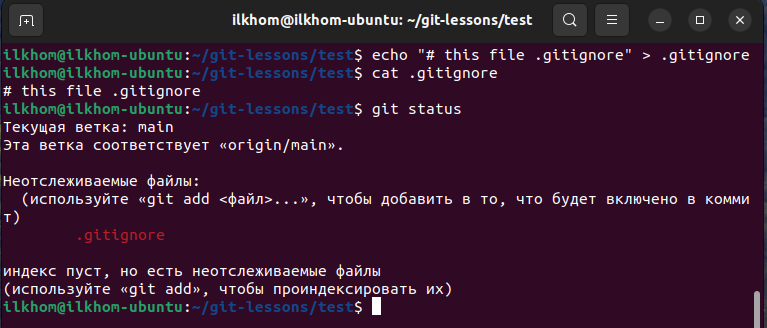
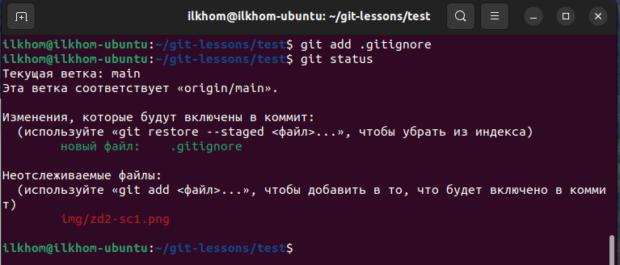
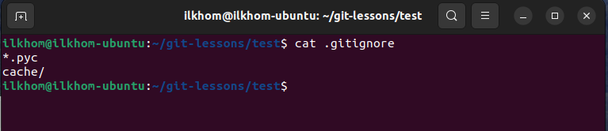
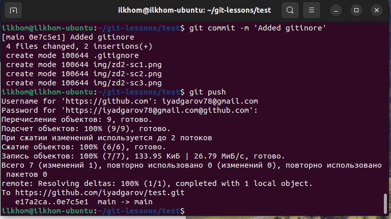
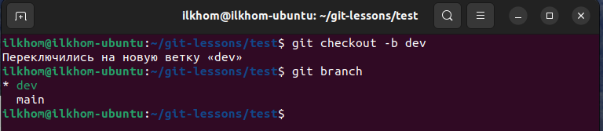
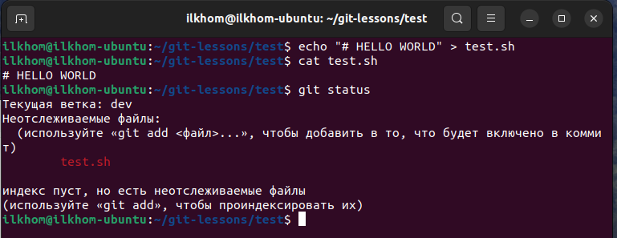
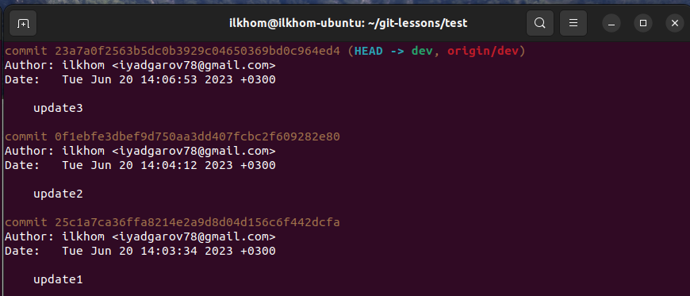

# Домашнее задание к занятию "`GIT`" - `Ильхом Ядгаров`

### Задание 1

1. Зарегистрируйте аккаунт на GitHub - **выполнено!** iyadgarov
2. Создайте публичный репозиторий. Обязательно поставьте галочку в поле «Initialize this repository with a README». - **выполнено!** test
3. Склонируйте репозиторий, используя https протокол. - **выполнено!** git clone https://https://github.com/iyadgarov/test
4. Перейдите в каталог с клоном репозитория. - **выполнено!**
5. Произведите первоначальную настройку Git, указав своё настоящее имя и email: git config --global user.name и git config --global user.email johndoe@example.com.
   **выполнено!**  
    ''

6. Выполните команду git status и запомните результат.
   **выполнено!**  
    ''

7. Отредактируйте файл README.md любым удобным способом, переведя файл в состояние Modified..`  
    **выполнено!** 
8. Ещё раз выполните git status и продолжайте проверять вывод этой команды после каждого следующего шага.
    **выполнено!**    
    ''
9. Посмотрите изменения в файле README.md, выполнив команды git diff и git diff --staged.
    **выполнено!**
    ''
10. Переведите файл в состояние staged или, как говорят, добавьте файл в коммит, командой git add README.md.  
    **выполнено!**  
    ''  
11. Ещё раз выполните команды git diff и git diff --staged.  
    **выполнено!**
12. Теперь можно сделать коммит git commit -m 'First commit'.  
    **выполнено!**  
    ''
13. Сделайте git push origin master  
    **выполнено!**
    
~https://github.com/iyadgarov/test/tree/6652ad0e28aeac5b0a68714a07c23738e043dbb2~ (Каюсь был невнимателен)  
данная ссылка на последний комит задания №-1  
https://github.com/iyadgarov/test/commit/e17a2ca1fb2bc58a59e5f2b858e8fd686620f7d5

---

### Задание 2

1. Создайте файл .gitignore (обратите внимание на точку в начале файла) и проверьте его статус сразу после создания.  
    **выполнено!**  
   ''
2. Добавьте файл .gitignore в следующий коммит git add  
    **выполнено!**  
   ''
3. Напишите правила в этом файле, чтобы игнорировать любые файлы .pyc, а также все файлы в директории cache.  
    **выполнено!**  
   ''
4. Сделайте коммит и пуш.  
    **выполнено!**  
   ''

~https://github.com/iyadgarov/test/tree/2980c29be6b6a0047d8882f88b3d7bbd5d1f5b72~ (Прошу прошения за невнимательность)  
Данная ссылка на последний комит задания №-2
https://github.com/iyadgarov/test/commit/92d1a928bed11d3a27c84adc0a0737bb53979e82
---

### Задание 3

1. Создайте новую ветку dev и переключитесь на неё.  
    **выполнено!**  
   ''  
2. Создайте файл test.sh с произвольным содержимым.  
   **выполнено!**  
   ''  
3. Сделайте несколько коммитов и пушей, имитируя активную работу над этим файлом.  
    **выполнено!**  
   ''
4. Сделайте мердж этой ветки в основную. Сначала нужно переключиться на неё, а потом вызывать git merge.  
    **выполнено!**  
   ''
5. Сделайте коммит и пуш.  
    **выполнено!**  
   ''

`При необходимости прикрепитe сюда скриншоты
`

https://github.com/iyadgarov/test/network

---

